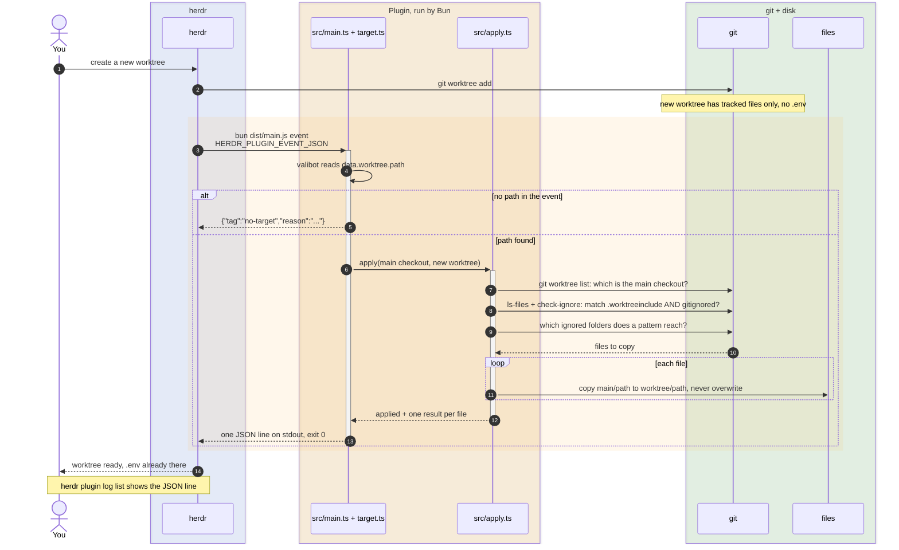
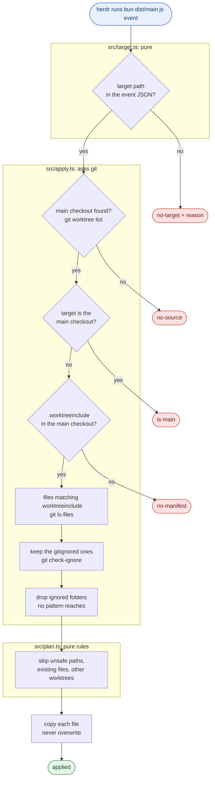
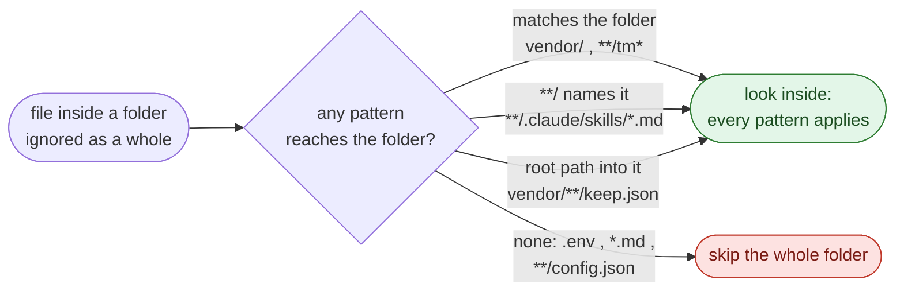

# How it works

What happens between "create a worktree in herdr" and "`.env` is there".

## The whole trip



## Who does what

| Piece     | Where                         | Job                                                                                           |
| --------- | ----------------------------- | --------------------------------------------------------------------------------------------- |
| herdr     | installed app                 | Creates the worktree, then fires `worktree.created`                                           |
| Manifest  | `herdr-plugin.toml`           | Tells herdr which command to run for the event and for the action                             |
| Bun       | on your `PATH`                | Runs `dist/main.js`. No install step, because the build bundles valibot                       |
| Entry     | `src/main.ts`                 | The only place that reads `process.argv` and `process.env`, and prints the outcome            |
| Target    | `src/target.ts`               | Pure: turns herdr's JSON into the target path, or a `reason` it is missing                    |
| Selection | `src/apply.ts`                | Asks git which files to copy, then copies them                                                |
| Rules     | `src/plan.ts`, `src/reach.ts` | Pure decisions: skip unsafe paths, existing files, other worktrees, unreached ignored folders |
| git       | on your `PATH`                | Does all pattern matching. No gitignore logic lives in TypeScript                             |

## How herdr calls the plugin

herdr reads `herdr-plugin.toml` when you install or link the plugin, and keeps a copy of it. Edit the manifest, then run `herdr plugin link .` again, or herdr keeps using the old copy.

```toml
[[events]]
on = "worktree.created"                      # fires after herdr creates a worktree
command = ["bun", "dist/main.js", "event"]

[[actions]]
id = "apply"                                 # "Apply worktree include", run by hand
contexts = ["workspace"]
command = ["bun", "dist/main.js", "apply"]
```

| Mode    | Triggered by        | herdr passes                | Target worktree comes from                                                 |
| ------- | ------------------- | --------------------------- | -------------------------------------------------------------------------- |
| `event` | a new worktree      | `HERDR_PLUGIN_EVENT_JSON`   | `data.worktree.path` (`src/target.ts:11`)                                  |
| `apply` | the action, by hand | `HERDR_PLUGIN_CONTEXT_JSON` | `worktree.checkout_path`, else the first CLI argument (`src/target.ts:12`) |

Anything else, or JSON that doesn't fit the schema, ends as `no-target` with a
`reason`, e.g. `{"tag":"no-target","reason":"HERDR_PLUGIN_EVENT_JSON: not JSON"}`.

## What the plugin does



Every box that ends in a tag is printed as one JSON line. The process always exits 0, so a failure here can never block worktree creation.

## Where git does the work

Every git call is in `src/apply.ts`, and each one answers one question.

| Question                                   | git command                                                                           | Function                          |
| ------------------------------------------ | ------------------------------------------------------------------------------------- | --------------------------------- |
| Where is the main checkout?                | `git worktree list --porcelain` (first entry)                                         | `worktreeRoots`, `mainWorktreeOf` |
| Which files match `.worktreeinclude`?      | `git ls-files --others --ignored --exclude-from=.worktreeinclude`                     | `matchedCandidates`               |
| Which of those are gitignored?             | `git check-ignore --stdin`                                                            | `matchedCandidates`               |
| Which folders are ignored as a whole?      | `git ls-files --others --ignored --exclude-standard --directory`, then `check-ignore` | `whollyIgnoredDirs`               |
| Does this folder match this one pattern?   | `git check-ignore --no-index` in an empty scratch repo                                | `dirMatches`                      |
| Does this root path point inside a folder? | `git ls-files --others --ignored --exclude=<pattern> -- <folder>`                     | `matchesInside`                   |
| Which other worktrees sit inside this one? | `git worktree list --porcelain`                                                       | `otherWorktreeRelativePaths`      |

Why git and not a glob library: negation (`!`), a trailing `/` for folders, and nested `.gitignore` files all behave the way git says, because git is the one deciding.

## Folders ignored as a whole

Claude Code has one extra rule, and this plugin copies it. A folder that is gitignored as a whole, like `node_modules/`, is only looked inside when some pattern **reaches** it. Once one pattern reaches it, every pattern applies inside.

A pattern reaches a folder when:

| Pattern kind                     | Example                  | Reaches the folder when                            |
| -------------------------------- | ------------------------ | -------------------------------------------------- |
| Matches the folder itself        | `vendor/`, `**/tm*`      | always                                             |
| Starts with `**/`                | `**/.claude/skills/*.md` | the first name after `**/` is in the folder's path |
| Root path (a `/` before the end) | `vendor/**/keep.json`    | it matches something inside the folder             |
| No slash                         | `.env`, `*.md`           | never, unless it matches the folder itself         |



Checked against real Claude Code 2.1.281 with `claude -p -w` in a scratch repo:

| `.gitignore`     | `.worktreeinclude`                       | File                          | Claude Code | Us  |
| ---------------- | ---------------------------------------- | ----------------------------- | ----------- | --- |
| `node_modules/`  | `.env`                                   | `node_modules/pkg/.env`       | ✖           | ✖   |
| `vendor/`        | `**/config.json`                         | `vendor/lib/config.json`      | ✖           | ✖   |
| `vendor/`        | `**/config.json` + `vendor/**/keep.json` | `vendor/lib/config.json`      | ✅          | ✅  |
| `docs-cache/`    | `*.md`                                   | `docs-cache/a.md`             | ✖           | ✖   |
| `.claude/local/` | `.claude/local/settings.json`            | `.claude/local/settings.json` | ✅          | ✅  |
| `tmp/`           | `**/tm*`                                 | `tmp/a.txt`                   | ✅          | ✅  |
| `vendor/`        | `vendor/`                                | `vendor/lib/x.json`           | ✅          | ✅  |

Without it, `.env` or `**/.env` would copy every `.env` shipped inside `node_modules`. The rule is `dropUnreachedIgnoredDirs` in `src/apply.ts`, and every row above is a `test.each` case in `src/apply.test.ts`.

## How a file gets from main to the new worktree

```
main checkout (source)                     new worktree (target)
~/code/app/                                ~/code/app-fix-login/
├── .worktreeinclude   ── read ──┐
├── .gitignore                   │
├── .env               ───────── copy ───▶ .env
├── .claude/skills/a.md ──────── copy ───▶ .claude/skills/a.md   (folders created)
├── link -> .env       ── recreate link ─▶ link -> .env          (never followed)
└── node_modules/pkg/.env    ✖ not reached
```

| Case                           | What happens                                           | Where     |
| ------------------------------ | ------------------------------------------------------ | --------- |
| Regular file                   | Copied with `COPYFILE_EXCL`, so it can never overwrite | `copyOne` |
| Symlink                        | Recreated as the same link, never followed             | `copyOne` |
| Already in the target          | Skipped, reason `exists`                               | `plan.ts` |
| Absolute path or `..`          | Skipped, reason `unsafe-path`                          | `plan.ts` |
| Inside another linked worktree | Skipped, reason `other-worktree`                       | `plan.ts` |
| Copy throws                    | Reported as `failed` with the error, the rest carry on | `copyOne` |

## Where Bun fits

| Bun does                                                                | Where                                  |
| ----------------------------------------------------------------------- | -------------------------------------- |
| Runs the plugin: `bun dist/main.js`                                     | `herdr-plugin.toml`                    |
| Spawns git and reads its output                                         | `Bun.spawn` in `runGit`, `gitExitCode` |
| Bundles `src/` and valibot into one file                                | `bun run build`                        |
| Runs the tests against real git repos in a temp dir                     | `bun test`                             |
| Runs the manifest's own command, as herdr would, in the end-to-end test | `src/e2e.test.ts`                      |
